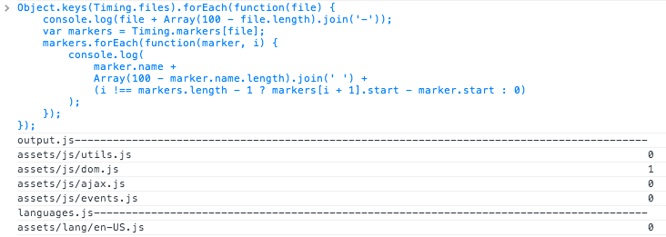

# Timing Data Inside JavaScript

One of the critical components to page load is JavaScript execution and initialization. When developing, it's easy to use your browser's developer tools to profile code and identify operations that introduce delays. For example, you might notice something like the following:


The above shows that somewhere during the execution of the JavaScript on the page, something happened that caused a style recalculation to occur (taking 11ms) and a layout recalculation followed (taking another 5ms). Without the developer tools, though, collecting this information requires special consideration. Most JavaScript is compiled into a single file (rather than many small files), meaning that even when the developer tools *are* available, the information that's provided doesn't necessarily indicate what exactly was the root cause of the delay.

The simplest way to combat this is to add timing markers during the minification process (minification is described in further detail in later chapters). During the minification process, many scripts are concatenated before being run through a tool to decrease the size of the resulting code. It might look something like this:

```js
var fs = require('fs');

var filesToMinify = glob('assets/');

fs.writeFile(
    'output.js',
    filesToMinify.map(function(filePath) {
        return fs.readFileSync(filePath).toString();
    }).join('\n')
);

```

To add timing markers, the above would be updated to look something like the following:

```js
var fs = require('fs');
var filesToMinify = glob('assets/');

const timingMarker = (
    ';' +
    'Timing = window.Timing || {};' +
    'Timing.files = Timing.files || {};' +
    'Timing.markers = Timing.markers || {};'
);

fs.writeFileSync(
    'output.js',
    timingMarker +
        'Timing.files["output.js"] = Date.now();' +
        'Timing.markers["output.js"] = [];' +
        filesToMinify.map(function(filePath) {
            // Create a marker to be inserted into the
            // compiled file before the included script
            var marker = 'Timing.markers["output.js"].push({' +
                // Save the name of the included file
                'name: ' + JSON.stringify(filePath) + ',' +
                // Save the time that the file started executing
                'start: Date.now()});';
    
            var source = fs.readFileSync(filePath).toString();
            // Return the marker plus the file's source
            return marker + source;
        }).join('\n')
);

```

When `output.js` (or any other JS file built in this manner) is included on the page, it creates a very handy object that looks something like this:

```js
Timing = {
  files: {
    // All of your JS files will appear here
    "output.js": 1399228214354,
    "languages.js": 1399228215002
  },
  markers: {
    // Each of the included JS files will appear
    // here with a corresponding time entry
    "output.js": [
      {
        name: "assets/js/utils.js",
        start: 1399228214354
      },
      {
        name: "assets/js/dom.js",
        start: 1399228214354
      },
      {
        name: "assets/js/ajax.js",
        start: 1399228214355
      },
      {
        name: "assets/js/events.js",
        start: 1399228214355
      }
    ],
    "languages.js": [
      {
        name: "assets/lang/en-US.js",
        start: 1399228215002
      }
    ]
  }
};
```

From this data, you can do some interesting things. For instance, the following code--when used as a bookmarklet--generates a nice chart in your console:

```js

// Available at http://git.io/Tyb6tw

Object.keys(Timing.files).forEach(function(file) {
  console.log(file + Array(100 - file.length).join('-'));
  var markers = Timing.markers[file];
  markers.forEach(function(marker, i) {
    console.log(
      marker.name +
      Array(100 - marker.name.length).join(' ') +
      (i !== markers.length - 1 ?
       markers[i + 1].start - marker.start :
       0)
    );
  });
});

```



Each line in the diagram shows how long each script took to execute.

There are plenty of other ways to generate this kind of timing information. In applications that wrap "modules" in functions (such as modules written under the AMD pattern), it would be easy to write a simple wrapper around `define` to generating timing markers for each module.

Using this data is more challenging. Especially for large applications with many hundreds (or thousands) of kilobytes of code, this solution can produce a lot of information. Sending all of this back to the server can be a burden, and processing it can be even more of a problem.

Instead, you can pare down the data on the client side. Many files will take less than a few milliseconds to execute; the data for those can simply be thrown out. Reporting data for scripts that take longer than 10ms is a great starting point. The reporting can be further refined to set thresholds for files that are known to cause long pauses (perhaps they inject HTML or add lots of complex styles).
