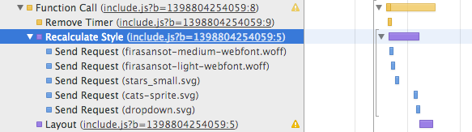

# Identifying Performance Issues

The first step to solving any web performance issue is to identify it. In many cases, this can be the hardest part of the increasing site performance: simply knowing that your site is slow in some cases gives you few clues as to what might be wrong or what should be changed.

To begin, as mentioned in the previous chapter, you must start collecting performance data about your site. If you're using Google Analytics already, this is a great first step, but you should plan to collect additional, more granular information to help find out what may need tuning.

The following sections outline resources that are at your disposal that can be used in both a development and production environment from a defensive standpoint.


## The Navigation Timing API

The single best source of information (besides the browser's developer tools) for performance-related information is the navigation timing API. This is available in all modern browsers except (at the time of writing) Safari. This API is a JavaScript object that contains the timestamps that `DOMContentLoaded` and the window `load` event start and stop, as well as other timestamps related to the browser's request and the server's response.

```js
var perfData = window.performance.timing;

// Total page load time
var totalLoadTime = perfData.loadEventEnd - perfData.navigationStart;

// Time until the page was ready
var readyTime = perfData.domContentLoadedEventEnd - perfData.navigationStart;

// Time taken on the client after the server finished returning the HTML
var clientTime = perfData.loadEventEnd - perfData.responseEnd;

// Time required to perform a DNS lookup for the page's hostname
var dnsTime = perfData.domainLookupEnd - perfData.domainLookupStart;

var sslHandshakeTime;
// Time required to perform the SSL handshake
if (perfData.secureConnectionStart) {
    sslHandshakeTime = perfData.connectEnd - perfData.secureConnectionStart;
}

alert('Page loaded in ' + (totalLoadTime / 1000) + 's');
```

During development, it's handy to keep a series of small scripts in bookmarklets or GitHub gists that can be pasted into the developer tools console. I keep one, for example, to output time to `DOMContentLoaded` and time to the window `load` event and refresh the page (very useful for collecting information for a benchmark).

The following members are available in the `window.performance.timing` object:

navigationStart
: The time that the client first started loading the page.

unloadEventStart
: If `unload` handlers were registered, this is the time that the client started firing the `unload` event on the previous page. If no `unload` event handler is registered on the previous page, this will be zero. Note that this may happen concurrently with the start of the next page's load (i.e.: the client may begin fetching the URL and following redirects as the `unload` event fires).

unloadEventEnd
: If `unloadEventStart` is not zero, this is the time that the client finished firing the `unload` event on the previous page.

redirectStart
: If the client encounters a redirect while loading the page, this will contain the start timestamp of the first request that was redirected. If there were no redirects during the page load process, this will contain zero.

redirectEnd
: If `redirectStart` is not zero, this will contain the timestamp of the last byte received from a redirect request.

fetchStart
: The timestamp that the client begins processing the request that loads the page. Note that this timestamp is marked before any connection or cache lookup is made.

domainLookupStart
: The timestamp that the client started performing a DNS lookup for the hostname of the page being loaded. If the DNS lookup was cached, this will be the same as `fetchStart`.

domainLookupEnd
: The timestamp that the client completed a DNS lookup. If no lookup was performed, this is the same as `fetchStart`.

connectStart
: The timestamp immediately before the client creates a TCP connection to the remote server that hosts the page. If the page is cached or an existing connection to the remote server is used, this contains the same value as `domainLookupEnd`. If the client needs to retry the connection for some reason (e.g.: there's a failure and the connection closes), this represents the start of only the last connection made to the server.

connectEnd
: The timestamp immediately after the client has finished establishing a connection to the server. If the page was cached or no new connection was made, this contains the same value as `domainLookupEnd`.

secureConnectionStart
: This member may not exist if the client does not support it (it will be `undefined`). It contains the timestamp that a secure connection was established but before the client performed an SSL handshake. If the page was not requested over HTTPS, this contains zero. This value (when non-zero) will always fall between `connectStart` and `connectEnd`.

requestStart
: The timestamp that the browser began a request to the remote server. This is the point at which the browser first started to send request headers. If the request needed to be restarted, it will contain the timestamp of the last attempt to send the headers.

  Note that no `requestEnd` exists: this is intentional, as computing this time can be expensive and it doesn't necessarily correspond with a time that the server receives the request.

  If the page is cached, this is the timestamp that the cache is queried.

responseStart
: The timestamp that the server receives the first byte of the response. If the page is cached, this is the timestamp that the cache responds with content.

responseEnd
: The timestamp that the server receives the last byte of the response. If the page is cached, this is the timestamp that the cache finishes sending content.

domLoading
: The timestamp at which the browser sets `document.readyState` to `"loading"`. This is the time that the browser begins constructing the DOM.

domInteractive
: The timestamp at which the browser sets `document.readyState` to `"interactive"`. This is the time that the browser has finished parsing all of the markup on the page but hasn't finished loading all of the assets.

domContentLoadedEventStart
: The timestamp immediately before the browser begins firing the `DOMContentLoaded` event.

domContentLoadedEventEnd
: The timestamp immediately after the browser finishes firing the `DOMContentLoaded` event.

domComplete
: The timestamp at which the browser sets `document.readyState` to `"complete"`. At this point, all resources required to load the page have finished processing.

loadEventStart
: The timestamp immediately before the browser begins firing the `load` event on the `window` object.

loadEventEnd
: The timestamp immediately after the browser finishes firing the `load` event on the `window` object.


Google Analytics will collect some basic information for you, including the total load time, DNS lookup time, time taken to create a connection, time between request and the beginning of the server's response, time until `fetchStart`, `domInteractive`, and `domContentLoadedEventStart`. [^ga_perf_timing] These different timings are exposed under Behavior > Site Speed > Page Timings. On that page, you can select the various metrics from the dropdown under DOM Timings and Technical.

[^ga_perf_timing]: This is based on an inspection of http://www.google-analytics.com/ga.js

Google Analytics only collects eight precomputed values, though, and each of the individual values of the navigation timing object are not collected or exposed. It's trivial to collect this information yourself, though there are libraries (such as Boomerang[^boomerang_github]) that will collect this information for you. Ideally, you would post this information via `XMLHttpRequest` or `navigator.sendBeacon` and aggregate it in a solution like Hive or Splunk (any data analytics solution that you're comfortable with will do).

[^boomerang_github]: https://github.com/yahoo/boomerang


## Timing Data Inside JavaScript

One of the critical components to page load is JavaScript execution and initialization. When developing, it's easy to use your browser's developer tools to profile code and identify operations that introduce delays. For example, you might notice something like the following:



The above shows that somewhere during the execution of the JavaScript on the page, something happened that caused a style recalculation to occur (taking 11ms) and a layout recalculation followed (taking another 5ms). Without the developer tools, though, collecting this information requires special consideration. Most JavaScript is compiled into a single file (rather than many small files), meaning that even when the developer tools *are* available, the information that's provided doesn't necessarily indicate what exactly was the root cause of the delay.

The simplest way to combat this is to add timing markers during the minification process (minification is described in further detail in later chapters). During the minification process, many scripts are concatenated before being run through a tool to decrease the size of the resulting code. It might look something like this:

```js
var fs = require('fs');

var filesToMinify = glob('assets/');

fs.writeFile(
    'output.js',
    filesToMinify.map(function(filePath) {
        return fs.readFileSync(filePath).toString();
    }).join('\n')
);

```

To add timing markers, the above would be updated to look something like the following:

```js
var fs = require('fs');

var filesToMinify = glob('assets/');

var timingMarker = (
    ';' +
    'Timing = window.Timing || {};' +
    'Timing.files = Timing.files || {};' +
    'Timing.markers = Timing.markers || {};'
);

fs.writeFile(
    'output.js',
    timingMarker +
    'Timing.files["output.js"] = Date.now();' +
    'Timing.markers["output.js"] = [];' +
    filesToMinify.map(function(filePath) {
        // Create a marker to be inserted into the
        // compiled file before the included script
        var marker = 'Timing.markers["output.js"].push({' +
            // Save the name of the included file
            'name: ' + JSON.stringify(filePath) + ',' +
            // Save the time that the file started executing
            'start: Date.now()});';

        var source = fs.readFileSync(filePath).toString();
        // Return the market plus the file's source
        return marker + source;
    }).join('\n')
);

```

When `output.js` (or any other JS file built in this manner) is included on the page, it creates a very handy object that looks something like this:

```js
Timing = {
  files: {
    // All of your JS files will appear here
    "output.js": 1399228214354,
    "languages.js": 1399228215002
  },
  markers: {
    // Each of the included JS files will appear
    // here with a corresponding time entry
    "output.js": [
      {
        name: "assets/js/utils.js",
        start: 1399228214354
      },
      {
        name: "assets/js/dom.js",
        start: 1399228214354
      },
      {
        name: "assets/js/ajax.js",
        start: 1399228214355
      },
      {
        name: "assets/js/events.js",
        start: 1399228214355
      }
    ],
    "languages.js": [
      {
        name: "assets/lang/en-US.js",
        start: 1399228215002
      }
    ]
  }
};
```

From this data, you can do some interesting things. For instance, the following code--when used as a bookmarklet--generates a nice chart in your console:

```js

// Available at http://git.io/Tyb6tw

Object.keys(Timing.files).forEach(function(file) {
  console.log(file + Array(100 - file.length).join('-'));
  var markers = Timing.markers[file];
  markers.forEach(function(marker, i) {
    console.log(
      marker.name +
      Array(100 - marker.name.length).join(' ') +
      (i !== markers.length - 1 ?
       markers[i + 1].start - marker.start :
       0)
    );
  });
});

```


Each line in the diagram shows how long each script took to execute.

There are plenty of other ways to generate this kind of timing information. In applications that wrap "modules" in functions (such as modules written under the AMD pattern), it would be easy to write a simple wrapper around `define` to generating timing markers for each module.

Using this data is more challenging. Especially for large applications with many hundreds (or thousands) of kilobytes of code, this solution can produce a lot of information. Sending all of this back to the server can be a burden, and processing it can be even more of a problem.

Instead, you can pare down the data on the client side. Many files will take less than a few milliseconds to execute; the data for those can simply be thrown out. Reporting data for scripts that take longer than 10ms is a great starting point. The reporting can be further refined to set thresholds for files that are known to cause long pauses (perhaps they inject HTML or add lots of complex styles).


## Storing Timestamps at Important Page Events

By "events," I don't mean DOM events. Instead, I mean events that are considered important in the normal page load process that aren't already reported elsewhere.

For example, in *Even Faster Web Sites*, Steve Souders recommends performing an early header flush that sends the `<head>` tag and the beginning of the page's body. This allows the browser to begin downloading assets listed at the start of the document while the server performs the rest of the processing for the page in parallel. In this scenario (and scenarios where more than one flush is performed), it's extremely helpful to know when the various flushes are taking place and how long it takes for the client to perform the necessary actions involved.

The following example shows how you might log this information. It uses PHP, though this should be possible in any language.

```php
<!DOCTYPE html>
<html>
<head>
  <title>My great page</title>
  <link rel="stylesheet" href="/static/include.css">
  <script src="/static/incude.js" defer async></script>
</head>
<body>

<script>
// Always make sure the Timing object exists before
// writing to it.
Timing = window.Timing || {};
Timing.events = Timing.events || {};
// Save a timestamp for the the "headFlush"
// event.
Timing.events.headFlush = Date.now();
</script>

<?php

// Flush the content of the page so far to allow
// the browser to start loading the JavaScript
// and CSS.
flush();

// Perform some operations that are going to take
// a while.
require('database.php');
DB::init();

$user = DB::getUser();

require('templates.php');
Templates::render('homepage.tmpl', [
    'user' => $user,
]);

?>
<script>
// Save a timestamp for the "bodyFlush" event.
Timing.events.bodyFlush = Date.now();
</script>
<?php

// Flush again for the body
flush();

Templates::render('footer.tmpl');

?>
</body>
</html>
```

Having this information is helpful because it allows you to identify when parts of the page are loading relative to your JavaScript, even if those pieces don't load in concert with the times listed in the navigation timing API.


## Make More Graphs

One of the most key aspects of identifying problems is being able to passively identify performance problems. Nobody has time to read through dozens--if not hundreds--of tables of numbers every day. Building software that can sniff out problems is equally hard. Instead, technology can be harnessed to help facilitate your understanding of your site's performance.

My personal recommendation is to set up monitors where you work that cycle through a series of charts. Graph everything: load times, ready times, times required to execute JavaScript...all of it. You don't need to be watching it constantly, but keep an eye on how the lines in the graphs move. If something looks interesting, it's worthwhile to run some queries and investigate.

Having charts and graphs of performance information also helps to outsource the work of identifying problems. If you work in an office with other engineers, it's not unlikely that you'll get lots of questions about what the graphs represent, or questions about why they changed in ways that they did. With more sets of eyes, it's easier to identify regressions. Not to mention, it helps draw attention to performance wins.


## Simplify

As mentioned in the introduction, simplifying code is a very important aspects of performance improvements. Besides the technical debt that complex or poorly written code bears, complex code tends to hide performance issues and can cloud the data that you collect about your application.

Consider the following snippet:

```js
// Please don't ever do this.
var containsTruthyValue = !!(Object.keys(mapping)
    .filter(mapping.hasOwnProperty.bind(mapping))
    .map(function(key) {return mapping[value];})
    .filter(function(x) {return !!x;})
    .length);
```

The above piece of code is an actual snippet that I reviewed (and rejected). To someone familiar with functional programming, the concept is simple:

- Find all of the members of the `mapping` object
- Remove any element in the list of members that aren't truthy
- Test whether the result has anything left

On paper, the steps sound straightforward, and in a lazy language this would probably be a satisfactory solution. What's actually going on, however, is chaotic. Four arrays are allocated and destroyed. Dozens, if not hundreds of function calls are made. Rather than finding one positive result and short circuiting, the code performs its manipulations on every single member of the original object and then throws all that data away. What an unholy waste.

An equivalent snippet of code simply would have been:

```js
var containsTruthyValue = false;
for (var key in mapping) {
    // Wow, for loops aren't so bad.
    if (mapping.hasOwnProperty(key) && mapping[key]) {
        containsTruthyValue = true;
        // I may be homely, but I'm fast as heck
        break;
    }
}
```

Not only is this code smaller (40 bytes less when minified with uglify.js) and more straightforward, it's also faster. Keeping code simple and obvious is infinitely more valuable, even if it means the final product is less sleek or pretty.

> Say what you mean and mean what you say

Furthermore, it's the case that if code is written in a way that's non-standard or confusing, it's more difficult for a compiler (or minifier) to safely optimize it. The wins that compilers could provide that are lost to codebases that have been prematurely optimized are so great that we cannot begin to imagine them.

> A man in the drive-through that orders something off-menu doesn't get any extra fries.


### Tech Debt

When I talk about tech debt, I am referring to problems with a codebase that decrease its overall quality. These are things like temporary hacks that never got removed, `TODO` comments that are months or even years old, pieces of code that should have been replaced or refactored but still serve some minor purpose.

Being able to identify and track tech debt can help to track performance. In almost all cases, tech debt results in sub-optimal behavior by the application. When you find tech debt, log it. File a ticket in your bug tracking software, write it down in a wiki, mark it with an easily `grep`-able comment, etc.

Over time, as you identify and log tech debt, it will become clear which components in your application need attention. Rather than individual functions and lines, you may find entire files or systems that--while perfectly functional--could be doing a better job (or can be replaced by something far simpler).


### Refactoring

Refactoring comes in many shapes and sizes. In some cases, it is the means by which tech debt is addressed. In other cases, it involves fixing the formatting of the code.

Refactoring can, however, have both positive and negative performance consequences. On one hand, a refactor could improve the efficiency of a component for common cases. On the other hand, a refactor could also introduce edge cases that perform much worse than the original code.

Before any refactoring work takes place anywhere in a codebase (front-end or back-end), you should ensure that there's an appropriate amount of instrumentation and reporting around those components so that issues can be identified and addressed as they arise.

Regular refactoring--regardless of how minor--is another technique to increase visibility of infrequently-looked-at pieces of code. It's easy to ignore pieces of an application that are known to work, but in doing so, you lose the ability to identify potential performance issues.

In my own work, I try to revisit every file I've worked on every four to six months or so. When I make my rounds, I look for the following:

- Has someone else changed my code? Does the code still work as I expect it to?
- Is the code I've written still effective?
- Has another part of the application changed in a way that would make my code be more effective if written differently?
- Have I learned anything since I last visited this code that could be applied to make it more effective?


### Premature Optimization

While simplifying code and eliminating tech debt is very important, it often coincides with premature optimization. Too often, engineers write "optimized" code with the intention of preventing a component from being slow without understanding the benefits that their efforts are yielding.

One of my biggest pet peeves is when I see code like the following:

```js
var sum = 0;
for (var i = 0, len = arr.length; i < len; ++i) {
    sum += arr[i];
}
```

Somewhere along the way, someone realized that caching the value of an array's `length` property saves some time. And in fact, caching `length` provides a 20% speedup (at the time of writing) in Google Chrome[^array_len_cached].

[^array_len_cached]: Results taken from http://jsperf.com/array-length-vs-cached, tested in Chrome 35.

Nobody cares. 20% of a fraction of a millisecond is still a fraction of a millisecond. The overhead from the loop will amount to--if you add all of the invocations of that code up from all of time--probably only a few seconds. Total.

The following code is identical in every way, except it's smaller and easier to read:

```js
var sum = 0;
for (var i = 0; i < arr.length; ++i) {
    sum += arr[i];
}
```

Given the number of `for` loops in a piece of code, it might even be the case that the amount of time saved by caching `length` is far outweighed by the amount of time spent downloading the extra code to cache the value of `length`.

The lesson to be learned here is that spending time optimizing code would be better spent analyzing the application as a whole and addressing lower-hanging fruit.
