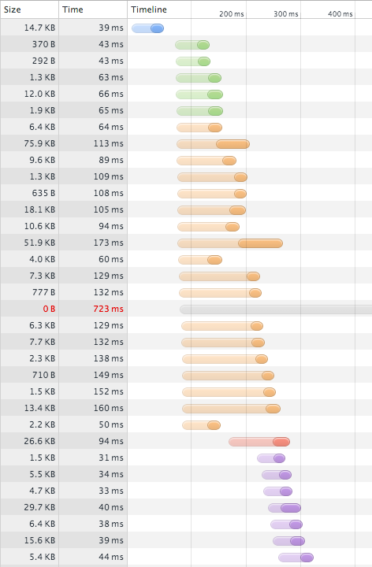

# Overview of a Page's Lifecycle

When you load a web page in your browser, there's quite a lot of things that happen. Especially in rich internet applications, browsers are doing an extraordinary amount of work. Some of these operations, such as network IO, can be done concurrently. Other operations, like constructing the DOM or performing certain operations in JavaScript, block the entire page load process.

DNS Lookups
: The first step in navigation to any page is the DNS lookup. Translating a domain name into an IP address is necessary, as without it, the client has no way of knowing what server to connect to. Fortunately, DNS lookups are cached and users will only experience the penalty of performing the lookup very infrequently. When DNS lookups neglected, however, they can cause a drastic negative impact on page performance.

TCP Connection
: Once a client knows what the address of the remote server is, the next step is to actually make the connection. Creating the actual TCP connection is somewhat of a cop-out on my part, since DNS lookups involve a TCP connection. Unlike a DNS lookup (which is almost always made to the user's ISP), the connection to the remote web server involves communication with an unknown third party. Rather than connecting to a server a few dozen miles away, the connection to the web server may reach to the other side of the globe.

SSL Handshake
: Every site should use HTTPS where possible. HTTPS comes at a cost, though: the handshake process used to exchange cryptographic keys at the beginning of the connection adds a number of extra roundtrips between the server and client.

Request
: Once the connection has been established (and secured, if over HTTPS), the client can make a request to the server. Depending on a number of factors, the information included in this request can be quite slow.

Redirect
: If the server receives a request and determines that the client should instead be requesting a different resource (or has completed its processing and is sending the client to another resource), it responds to the client with a redirect. A redirect is a combination of a `3XX` status code and a `Location` HTTP header.

Response
: After the server receives the client's request, it can begin processing and formulating a response. The first part of this response is the HTTP response headers, followed immediately by the content the user requested.

Assets and Payload
: Once the client has begun receiving the server's response, it will attempt to being parsing it. In the process, the client will make additional requests to the server as the response indicates more assets are required to build the page. This can include core components of the page, such as CSS, JavaScript, and images, and it can also include other content like fonts, multimedia and plugins, other pages and framed content, and more.

Render and Composite
: As the client builds the page that the user requested using the assets that it fetched, it begins calculating the layout of the page that was requested, rendering and compositing the elements in the layout, and painting those elements to the screen. The processes involved in this step are known as the "critical path."

Execution
: As the client downloads JavaScript, it must be executed (though the point at which the scripts execute may vary depending on how they were included in the page). Execution describes the initial "run-to-completion" for the scripts on the page.

Initialization
: There are a number of points at which the scripts on a page may execute. It's rarely the case, however, that any of these points are ideal times to begin running application logic; the DOM may not be available, other scripts may not have run yet, or other dependencies may not yet have been met. Initialization is the point at which applications choose to begin running application logic and setting up state for the page.

## Page Lifecycle and Performance

It's rarely the case that a website is inherently slow. Unless a synchronous operation blocks for a fixed amount of time (i.e.: a `while` loop that iterates until a certain number of milliseconds have passed), it's possible for any computer to render any given page in a very small amount of time, given infinite resources (network throughput, CPU, GPU, etc.).

Computers with infinite resources do not exist, though, and the constraints of the hardware--and in some cases, software--of the visitors to any particular site are the limiting factors in a page's load time.

Consider the following waterfall diagram, produced by the Chrome Developer Tools (for a site which shall remain nameless):

In this example, you'll notice that there are many connections to the server, and many of those connections are for resources which could have been combined. The page loads on my cable internet connection in three seconds.

All in all, performing some simple optimizations could have saved this site nearly two seconds of load time, bringing the time until the page is interactive from one and a half seconds to under half a second.

These topics will be discussed in greater detail in the next few chapters, but the high-level goals are to do the following:

- Decrease the impact of latency by minimizing the amount of back-and-forth communication between the client and the server.
- Decrease the amount of work that needs to be done in order to deliver and render the page.
- Optimize the amount of information sent over a single connection in order to take advantage of the user's bandwidth.
- Increase the number of operations the browser can perform concurrently while avoiding the cost of creating additional connections.
