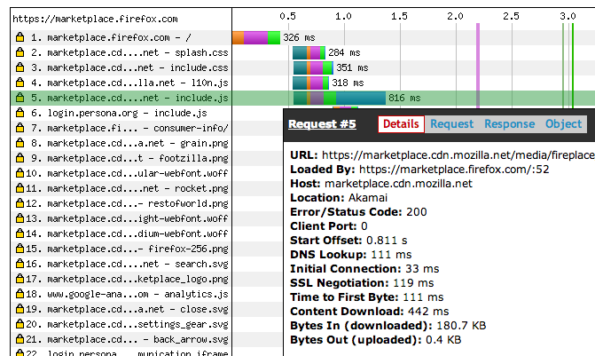
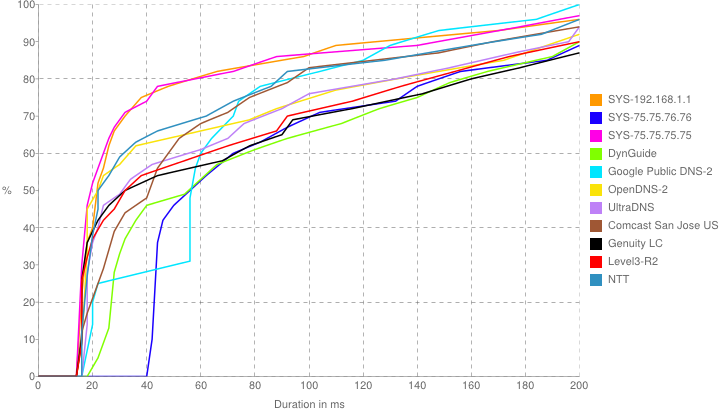
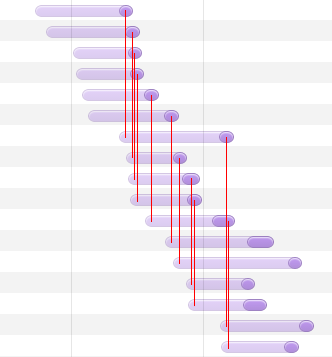

# Connection and SSL

## DNS Lookups

Most engineers don't consider DNS lookups when they are optimizing their page's load time for a few reasons:

1. During development, you probably aren't connecting to a remote server.
2. If you are connecting to a remote server, your browser or operating system probably has the DNS lookup cached.
3. Most developers are on relatively low-latency connections and DNS lookups are fast.
4. There isn't much you can do to speed the DNS lookup up.

To demonstrate the performance impact of a DNS lookup, consider the following waterfall diagram of a website:



You can see in this diagram that it took 111ms before the browser could even begin to connect to the CDN and perform an SSL handshake. If your goal is to make a page load in under one second, 100ms is not something you have to spare.

DNS lookups should be considered slow by default, and they play a very large role in decreasing the performance of websites. To illustrate, here's a graph generated by the open source application namebench:



This benchmark was run from my apartment in Mountain View, California over wifi. My ISP is Comcast, and the results support that: the two lines furthest to the left are Comcast's DNS server (75.75.75.75) and my wireless router (which uses Comcast's DNS)[^google_dns_throttle]. Curiously, Comcast's alternate DNS server (75.75.75.76) is among the slowest, taking a minimum of 40ms for its fastest response.

[^google_dns_throttle]: It should be noted that the results for Google's DNS servers shift sharply to the right, indicating that their servers may have throttled connections from my IP address during the test, resulting in unusually high lookup times.

My internet connection is average, or perhaps slightly above average compared to the rest of the continental US. Based on this benchmark, however, you can see that DNS lookups took--regardless of the DNS server--a minimum of about 15ms for the absolute fastest responses. The 80th percentile (one out of every five), though, took longer than 60ms. At the 90th percentile, lookup times nearly triple to well over 150ms.

### Remedying slow DNS lookups

There's very little you can do to make DNS lookups faster, but you can do a number of things to decrease their impact.

The first solution is to use a single domain name. If you don't need separate subdomains, don't use them. The more domains in your application, the more DNS lookups that will need to be performed, and removing all but one ensures that your page load time is not impacted more than once.

Unfortunately, using a single domain is rarely an option for many websites. To use CDNs or take advantage of domain sharding (both discussed later), it's often necessary to have--at minimum--a second subdomain.

In this case, the second best option is to give the browser a hint about where your content is hosted before you request it. This is very easy: simply drop the following `<link>` tag on your page for each domain your site accesses:

```html
<link rel="dns-prefetch" href="//your.other.domain.com">
```

The browser will use that information to immediately start a DNS lookup of the hostname specified. If a request is made where the hostname matches the domain in the `href=""`, the corresponding address will already be cached.

This even works if you send HTML to the browser incrementally (e.g.: using PHP's `flush()` function). The browser will kick off the DNS lookup immediately, and resources sent to the browser later as part of the same page will use the cached response.

Lastly, if you are taking advantage of domain sharding, it's likely that you're imposing a very large number of DNS lookups on the client. For instance, a site using domain sharding might make the following requests:

```
www.mysite.com
static1.mysite.com
static2.mysite.com
static3.mysite.com
```

At more than 100ms each, the volume of DNS lookups can quickly dominate a large part of your page's lifecycle. You can mitigate this issue by implementing SPDY on your server. Domain sharding is used to circumvent caps specified by the browser to limit the number of connections to any one host. SPDY combines an unlimited number of concurrent requests into a single connection, meaning users with modern browsers accessing sites that support SPDY will only perform a single DNS lookup. This solution obviously has all of the downsides of implementing SPDY, which are outlined in the section dedicated to SPDY.

## TCP Connections

Like DNS, the actual TCP connections involved in each request are an often-overlooked component in web performance and a piece which has few remedies. TCP connections are inherently expensive: connecting and disconnecting each involve one and a half round trips. Most browsers limit the number of connections that can be made to any given host. There are a number of signals that you can look for, though, that can indicate a potential performance bottleneck.


### Too many connections

Until recently, browsers limited the number of HTTP connections to any single host to 2. Most modern browsers have increased that limit to at least 6[^ie_connection_limit]. This number is usually sufficient for relatively small pages with only a small number of assets, but it can be disastrous for content-heavy pages that make dozens of requests.

[^ie_connection_limit]: Internet Explorer 10 and up and Opera 10 have a limit of eight concurrent connections rather than six.



The above is a screenshot from the Chrome developer tools showing a series of requests for images. I've drawn in red lines to show that the end of one request triggers the start of another. Also notice that no more than six requests are triggered concurrently at any given time.

The first way to remedy this is to make sure that if you can, SPDY is implemented on the server. SPDY allows an unlimited number of concurrent connections, and the server can decide how it wants to respond to them depending on load.

The second solution to this is to simply decrease the number of requests. Even with SPDY, the more requests that are made, the longer it takes to load the page for the simple reason that there's more things to do. If multiple files can be combined with no impact on the user, that is a worthwhile change to make. Later chapters discuss in more detail how to effectively combine assets.

Lastly, you can use a technique known as domain sharding. Domain sharding (as described previously with regard to DNS lookups) involves creating several DNS records for the same host. For instance, `static1.example.com`, `static2.example.com`, etc. might all point at the same IP address. In the document, the URLs for each asset are changed to point at a different subdomain. In doing this, the browser recognizes each hostname as its own server and applies the six connection cap to each hostname. If you use `static1` through `static4`, you would expect to be able to six connections to each host concurrently, allowing up to 24 simultaneous connections.

As mentioned previously, domain sharding comes at a cost: DNS lookups. Despite each hostname pointing at the same IP address, the browser does not know that until after it has performed a DNS lookup.


### High latency

For users on high-latency connections, creating many TCP connections may be impractical. Other users may have artificially restrictive limits on TCP connections (such as users communicating through an HTTP proxy). In this case, the best solution is to simply decrease the amount of time it takes to establish a connection.

To do this, collect some data. Measure the amount of time it takes to establish a connection to the web server from a point very near to the server (i.e.: from another server in the same data center). If that number is high, you should investigate the stack that you're using on the server. If you don't have a load balancer, or are using a single-threaded server, simply installing a reverse proxy like Nginx may solve much of the problem.

For users that are located internationally, long connection times may simply be a result of distance. Consider using a CDN to serve assets: a CDN can be globally distributed to decrease the physical distance that must be traversed and number of digital bottlenecks that a connection must overcome in order to reach the server.


## SSL

SSL is a misused term: the actual SSL protocol was deprecated many years ago and was replaced with a protocol named TLS, or Transport Layer Security. Few internet users, however, have ever heard the term TLS, and certificates are still sold to site owners as "SSL certificates" in many cases.

One of the biggest web performance myths in existence is that HTTPS is slow because all of the information transferred must be encrypted. This is false. The overhead of secure connections is so incredibly low that most site owners will never notice it.

The primary bottleneck involving secure connections is the number of round trips that are necessary to establish a connection. Two full round trips are necessary as part of a "handshake" to exchange cryptographic key information before the client can even begin to make a request.

One half of the solution to the number of SSL handshakes that need to be performed is to simply decrease the number of requests. This follows the same advice as handling large number of TCP connections (discussed in the previous section). The fewer connections that need to be made, the fewer times you need to pay the penalty of the handshake.

Having a CDN can also help immensely. A CDN with a local point of presence (PoP) near to the user decreases the amount of time it takes to actually perform the handshake. Additionally, some CDNs or network service providers will offer SSL termination services that allow you to terminate the SSL connection to the user in a local PoP rather than in a data center far away. This means that you can take advantage of the speed gains that your assets would otherwise receive on your server.

It is possible to create your own SSL termination proxy using open source software like Nginx in combination with a geographic DNS service, though the effort involved in very high. Maintenance and operation costs of such a solution are likely higher than outsourcing the effort to a third party.


## CDNs

A CDN, or Content Delivery Networks, can do a lot to help speed up a website. Most CDNs offer a plethora of services:

Local Points of Presence (PoPs)
: Servers that are geographically close to users in a particular region. These servers allow users to connect with much lower latency than if they had been connecting over a much larger distance. Strategic positioning of PoPs allows a CDN to minimize the number of network "hops" a client needs to make to interact with the server.

SSL Termination
: By terminating SSL (or performing the SSL handshake) closer to the user, connections can be established much more quickly, allowing the client to make requests faster than they otherwise could.

DoS Protection
: Many CDNs market DoS (denial of service) attack prevention. By sitting between users and web servers, the CDN can be better prepared to accept a flood of requests from an attacker, or to block the flow of traffic from compromised users.

Full-Blown Features
: It's usually the case that CDNs are quick to implement performance-improving features and cutting-edge technology for content delivery. This includes technology like SPDY, IPV6, and low-level connection tuning.


### How does a CDN work?

Setting up a CDN is usually very simple to do. Virtually all CDNs operate as proxies that mirror the content from another site. For instance, you might set up `cdn1.example.com` to point at a CDN mirroring `www.example.com`. When `https://cdn1.example.com/asset/include.js` is requested, the CDN would fetch `https://www.example.com/asset/include.js` and cache it. All users requesting that URL from that point on would fetch the cached version of `include.js`.

>A Note that changing content once it has been cached by a CDN is not always possible. To modify the content, you must access it with a different name.
>A
>A For example, you might reference `https://cdn1.example.com/asset/include.js?20140101` to refer to a version of the file that was updated on January 1, 2014. Every time the file changes, you would update the query string to refer to a URL for the updated version. Using hashes instead of dates or times is also common.

Most CDNs accomplish this mirroring via DNS. Some CDNs, such as CloudFlare, will ask you to change the nameservers for your domain to point at their own nameservers. In doing this, they are able to automatically set the addresses for each of your hostnames to the addresses of their own PoP servers. Other CDNs, like EdgeCast, will give you hostnames to add as CNAME records in your own DNS manager.

Another type of CDN, like Amazon CloudFront, allows you to upload files to some sort of storage. You are then provided with a hostname that you can point users at directly, or point a CNAME record at. Depending on your use case, this may be more or less convenient.


### Pitfalls

One of the most perplexing issues than many people encounter when evaluating a CDN is that they see *slower* responses than accessing their content directly. This is usually the case when only a small number of users are accessing a site with a CDN, especially if the users are distributed around the world.

The cause is that the CDN simply hasn't seen the files that the user is requesting yet. If you request a file from a CDN and the CDN doesn't have a copy of the file, it needs to pause the request, visit your server, wait for a response, then forward it on to the user. Until all of the servers in all of the applicable data centers at your CDN have seen all of your files, you'll notice some poor response times.

Another common pitfall is a CDN over-selling its service. When you use a CDN, your content is hosted on the same servers that host content for thousands of the CDN's other customers. If one of the CDN's other customers is experiencing a DoS attack, the speed of your website could be negatively impacted. Be sure to thoroughly research all of your options before you commit to any CDN.

> Snake oil makes you feel great until you need to hit the commode

Cost can be another pitfall with a CDN. Before choosing a CDN, model your expected costs based on your own data. Consider how much it will cost to be a customer with historical data, and also project figures accounting for future growth. Also be sure to compare this with the cost of bandwidth on your current host (if any) to account for potential savings. On some platforms, like Linode or Microsoft Azure, large amounts of bandwidth can be far more expensive than using a CDN to transfer the same content.


### The myth of the P2P CDN

A technology that took the internet by storm in recent years has been the (alleged) peer-to-peer CDN. The concept uses WebRTC: a very new web technology that allows browsers to communicate with each other directly. Content is (allegedly) transmitted from the original host or a traditional CDN to one or more clients, and those clients then distribute the content to other clients that visit the page.

On paper, this idea is phenomenal. In practice, this is almost entirely useless for serving anything other than very large files, like videos or music.

- You need to have multiple concurrent users visiting the same site with the same set of assets.
- You need to deliver a rather large script to each user to allow the clients to be able to establish the P2P connection and communicate effectively. By the time such a script was sent, your page could have been mostly loaded.
- Connecting the users to each other isn't instantaneous (or guaranteed to work 100% of the time), and that doesn't account for the time required for peers to advertise which pieces of the content they have or can provide.
- An attacker could pretend to be another client visiting your site and simply send garbage to legitimate visitors. Even if the clients perform checksums on the data and throw out the garbage, an attacker could potentially lay waste to the performance of a site, or bring it down entirely.

It's unlikely that P2P CDNs are going to become a viable technology for most websites to take advantage of for quite a long time. In testing out various P2P CDNs for myself, I discovered that most can't even make their own demos function properly due to a lack of users accessing their website.


## SPDY

SPDY is a very new and very powerful tool developed by Google for improving web performance. It functions as a substitute for HTTP at the protocol level: requests are sent in a way that's very similar to traditional HTTP, and applications running on the web server are generally not even aware that the requests they are receiving were made over SPDY. In fact, neither the Chrome nor the Firefox developer tools distinguish requests made by SPDY from requests made over normal HTTP.

In general, there are virtually no downsides to using SPDY over HTTP.


### How does it work?

When a browser connects to a server and establishes a secure connection, the remote server uses a TLS extension known as *Next Protocol Negotiation* to signal to the client that it will use SPDY if the client is okay to use it. If the client can accept SPDY, the SPDY connection is established.

Once the connection has been established, the client will make as many requests as it needs over the same connection. The server will then respond with each of the files multiplexed over the same connection. Each of the requests and responses compresses the headers using Gzip or DEFLATE. If the server can predict what the client is going to do next, it can preemptively send assets to the client before they have been requested.

- Single connection means one SSL handshake
- Compressed headers means far less information is sent over the wire (in both directions)
- Low overhead for requests means minified files don't need to be concatenated: they can be requested individually, improving caching and decreasing waste from downloading unnecessary files
- No need for domain sharding (in fact, domain sharding hurts SPDY)
- SPDY connections stay open, preventing future requests from needing to open a new socket

Results posted in Google's SPDY whitepaper[^spdy_whitepaper] show speedups of 25% to 60%, though in practice improvements of 5% to 15% can be expected[^spdy_improvement].

[^spdy_whitepaper]: http://www.chromium.org/spdy/spdy-whitepaper
[^spdy_improvement]: From *A comparison of SPDY and HTTP performance* by Microsoft Research, and my own experience


### Good god that's fast

You're not kidding.


### Which users benefit

All users are going to benefit from SPDY, but different users will benefit in different ways.

- **10th percentile users:** Users that already have very fast connections will see minor improvements in areas where large numbers of requests are being made. Improvements will also be seen when making subsequent requests, as a new connection and handshake don't need to be made.
- **50th percentile users:** These users will see a substantial benefit from the decreased need to make many connections to request many assets. As soon as the SPDY connection opens, the browser can make unlimited requests, not just one.
- **90th percentile users:** These users will see all of the benefits seen by the other users. Additionally, the 90th percentile will benefit from header compression. Headers are largely redundant between requests, and eliminating duplicate information shaves off a non-trivial number of TCP round trips.


### Downsides and Myths

SPDY is actually slower than plain-old HTTP
: False. There is virtually no real-world evidence suggesting that SPDY is ineffective. A number of benchmarks have appeared that show SPDY to be slower across the board, though this can be attributed to a number of flaws in the benchmarks:
  - Testing in low-latency, high-bandwidth local connections rather than over the internet
  - Sharding SPDY connections across domains (as mentioned previously, domain sharding hurts SPDY performance)
  - Using a SPDY proxy rather than running a server that delivers content directly
  - Comparing benchmark data from a SPDY mirror of a website to the website itself rather than a HTTP(S) mirror of the website

  It *is* possible for non-SPDY requests to load faster when executed in parallel than the same requests made over a SPDY connection, but this is only possible on very fast network connections with low latency.

SPDY doesn't work on sites that pull in third-party content
: Partly false. SPDY doesn't work across domains unless the domains share the same IP address. Third party content doesn't (usually) live on the same address as first party content, meaning that SPDY connections are simply not used for third party content (unless of course the third party host uses SPDY).

SPDY is hard to configure
: This is indeed something of a downside. For many developers, even setting up HTTPS properly and making sure it stays properly configured and up-to-date can be a real challenge. Implementing SPDY alongside that configuration doesn't make the challenge any easier.

SPDY isn't supported in IE
: This is essentially true. Only version 3 of SPDY is supported by Internet Explorer, and even then only when running on Windows 8. This is because only Windows 8 supports the TLS extension (NPN) needed to signal that the client can use SPDY.


### How to set it up

TODO


### QUIC

QUIC is another project by Google to eventually become the successor to SPDY. It is currently in a highly experimental state. Unlike SPDY, QUIC uses UDP rather than TCP, enabling content to be received in a truly asynchronous manner and eliminating blockages caused by a single slow packet. QUIC also seeks to decrease the number of round trips made to and from the server, and eliminate most--if not all--of the time required to establish a connection.

QUIC is currently implemented in Chrome and Opera and can be enabled by visiting `chrome://flags` and `opera://flags` respectively. Most Google properties support QUIC, and a reference implementation has been published in the Chromium source code repository.
