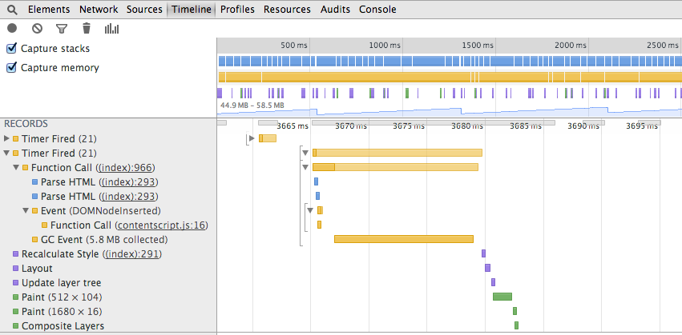
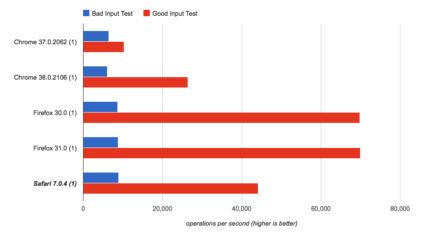
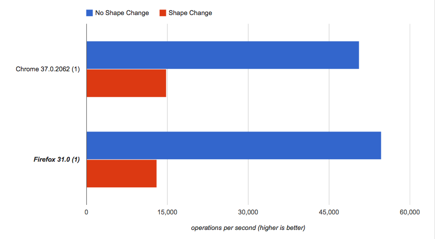
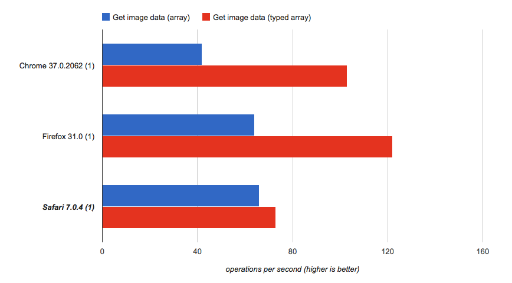
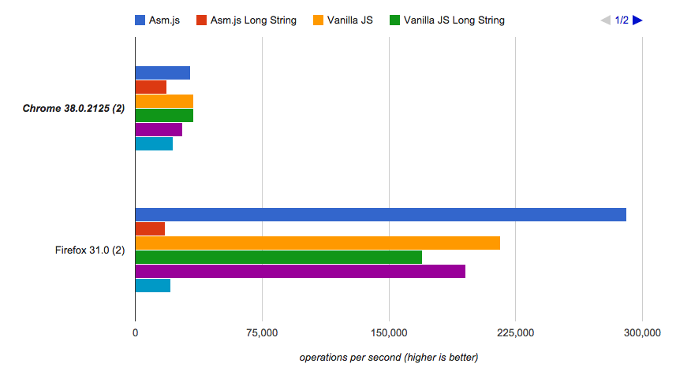

# JavaScript

## The Event Loop

All browsers run on what is known as an event loop. The event loop is just that: a single loop that checks if there is any work to be done and if there is, it does it. Granted, there are parallel operations that take place (certain compositing operations and web workers, for instance) but in general, a surprisingly small amount of parallelism exists in your browser[^servo_parallel].

[^servo_parallel]: Servo, a project from Mozilla, seeks to build a browser that takes advantage of parallelism in all aspects of the page lifecycle. https://github.com/mozilla/servo

The event loop handles the execution of all JavaScript. When something in JavaScript needs to be done, the event loop notices the task and fires the appropriate code, waiting for it to complete. Since JavaScript is single-threaded, all other code will wait for it to finish, no matter what. Even `setTimeout` commands will wait until executing scripts have completed, regardless of how soon their timer is set for. This is the same reason that all browsers ask if you want to "stop unresponsive scripts" when a piece of code runs for a very long time without ever finishing. Perhaps it is stuck in an infinite loop or performing some sort of extremely intense processing; regardless, it is not finishing a run to completion and yielding control of the browser back to the event loop.

The process of the event loop triggering a JavaScript function and waiting for all subsequent processing within the JavaScript engine to complete is known as a "run to completion." Understanding how this works is very important to being able to understand the performance characteristics of an application.


## Browser Events

An event is simply an object that represents something that happened in the browser. JavaScript code can set up listeners for these objects using the `addEventListener` method. When an event occurs, the event loop begins executing the JavaScript code for each registered event listener in turn, passing the event object around.

More interestingly to the performance of the application is the purpose of the events that are fired. Of all of the different events, the following are the most critical to understand:

`load`
: The `load` event fires on any element that has just completed loading. It also fires on the `window`. When the window load event has completed loading, the page no longer has any further processing to do related to its lifecycle. At this point, the browser loading indicators will go away.

`DOMContentLoaded`
: This event fires after a page has started loading but before `load` has fired. It signals that the page is at a point where the user can begin interacting with its content. This means that the DOM has finished loading and all scripts have loaded and executed[^firefox_dcl_bug].

`visibilitychange`
: As discussed in Chapter 5, a very powerful technique for improving performance is page prerendering. In order to detect whether the page is being prerendered, you can use the page visibility API, which can be listened for using the `visibilitychange` event in combination with `document.visibilityState`. This is critical if animations or effects need to be shown to the user upon their visit (otherwise they will have started when the page is still being prerendered).

`readystatechange`
: Prior to Internet Explorer 9, there was no support for `DOMContentLoaded`. Instead, `readystatechange` could be used in conjunction with `document.readyState`. Similar results could be achieved on very basic pages, but various browser bugs ultimately made the results behave more like `load`. Unless you require old IE support, it is recommended that you do not use `readystatechange`.

[^firefox_dcl_bug]: Firefox has a very nasty bug which causes `DOMContentLoaded` to fire before certain scripts have finished executing. It has been fixed, but it will not become generally available until Firefox 31. A workaround does exist, which will be presented in upcoming sections. http://bugzil.la/688580

Now you might ask yourself, "which event should my application listen for to start page execution?" That's a great question and unfortunately, the answer is not simple.

- Use `load` if your code relies on everything on the page being loaded, including images and `iframe`s.
- Use `DOMContentLoaded` if your code relies on all other scripts on the page having been executed.
- If your scripts are located at the end of the `<body>` and each script file does not depend on any resource on the page being loaded or any script that comes after it (and the scripts are not given an `async` attribute), you do not need to use *any* event. Simply execute your code immediately.
- If your scripts are marked with `defer` and they do not rely on any script that comes after themselves, you probably do not need to use `DOMContentLoaded`. `defer`'d scripts will always run after the DOM has completed loading. This allows your code to execute sooner.

Some interesting notes:

- jQuery's `ready` event (and closures passed to `$()`) are fired on `DOMContentLoaded` or on `readystatechange` when `document.readyState === 'complete'`.
- In the vast majority of circumstances, code can run on `DOMContentLoaded`. `load` is a poor option because it will wait for images and stylesheets to load, which will cause the page to appear and behave as if it is broken for a short time until absolutely everything has finished loading.
- When using the `readystatechange` event, you must check `document.readyState` to determine whether the page is ready yet. When `readyState` equals `'complete'`, the page is definitely ready. If your code does not do anything strange (particularly around `document.write`), you can check if `readyState` equals `'interactive'`, as well.


## Defer, Async, Both, Neither

HTML5 adds two new attributes to the common `<script>` tag which can be used to improve the load times of pages containing one or more JavaScript files. These attributes are `defer` and `async`, and each offers subtle behavior changes that can help you to tune the performance of your page by minimizing the amount of time the browser spends idle waiting for network requests to complete.

The gains that this section purports may be greater or lesser depending on the browser. Modern browsers include what is known as a "preloader." The preloader will "look ahead" at the HTML that has been downloaded while `<script>` tags without `defer` or `async` are running. In doing so, the browser can get a head-start on downloading files that it thinks it will need in order to put the rest of the page together.

This is non-standard behavior, though. The HTML specification officially says that the browser should stop and wait while `<script>` tags are downloading and executing. The performance gains of using the preloader, however, are far too great to ignore: Mozilla reports a nearly 16% improvement[^firefox_preloader_bench] and Google reports a roughly 20% improvement[^chrome_perloader_bench].

[^firefox_preloader_bench]: https://bugzilla.mozilla.org/show_bug.cgi?id=364315#c38
[^chrome_perloader_bench]: https://plus.google.com/+IlyaGrigorik/posts/8AwRUE7wqAE

Even with the preloader in place, you can still provide significant benefit to your site by using `defer` and `async` to hint at how and when the browser should execute your code.


### `defer`

- Inline scripts (i.e., script without a `src=""` attribute) will ignore the `defer` attribute.
- All external `<script>` tags with the `defer` attribute will load in parallel (up to the per-domain connection limit).
- As each deferred script finishes downloading, it will execute.
- A deferred script will not execute until all previous deferred scripts have downloaded and executed.
- Deferred scripts should *never* call `document.write` or any similar functions.
- Deferred scripts will wait to execute until the full page has been downloaded and parsed. i.e., they will wait for the DOM to be fully loaded.
- Deferred scripts will block `DOMContentLoaded` from firing.

From a high level, a script with the `defer` attribute behaves very similarly to the default behavior of external script tags. Here are two scenarios:

```html
<script src="js/en-US.js"></script>
<script src="js/include.js"></script>
```

In the above example, the browser will download and execute the first script, then download and execute the second script.

```html
<script src="js/en-US.js" defer></script>
<script src="js/include.js" defer></script>
```

In the second example, the browser will begin downloading both files simultaneously. If `en-US.js` loads first, it will execute as soon as it can. If `include.js` loads first, it will wait for `en-US.js` to finish downloading and executing before it executes itself.

Most sites that do not have any inline scripts can safely add `defer` to all of their script tags without any other changes to their code. For browsers that support `defer` but do not have a preloader, this can provide immediate and significant performance improvements.

Because deferred scripts will wait until the DOM has completed before executing, it does not matter where the scripts are located on the page. This means that scripts can be placed earlier in the document (e.g., the `<head>`) in order to start downloading sooner without needing to worry about whether problems will arise because the DOM is not available. For example, consider the following code:

```js
alert(document.body.innerHTML);
```

If we save the above JS into `test.js` and run the following code, some potentially unexpected behavior will occur:

```html
<html>
  <head>
    <title>Demo</title>
    <script src="test.js"></script>
  </head>
  <body>hello</body>
</html>
```

If the above snippet is run, a JavaScript error will occur! `document.body` is undefined because when the script is running, the `<body>` hasn't been encountered yet and thus `document.body` hasn't been set. This problem can be completely resolved by putting the `defer` attribute on the `<script>` tag:

```html
<html>
  <head>
    <title>Demo</title>
    <script src="test.js" defer></script>
  </head>
  <body>hello</body>
</html>
```

With the `defer` attribute, you will receive an alert containing "hello", as you would expect.

You should use `defer` under the following circumstances:

- There are no inline scripts on your page, or none of the inline scripts depend on external scripts having been loaded.
- Your scripts are located at the end of the `<body>` to prevent issues related to the DOM being absent.
- Your scripts do not call `document.write` or `document.writeln`.
- Your code does not need to support Internet Explorer 9 or below. A bug in the way old IE supports deferred scripts will cause the scripts to occasionally execute out-of-order.


### `async`

The `async` attribute is similar to the `defer` attribute, but the scripts may be executed at wildly different times. Unlike `defer`, scripts loaded with `async` are not executed in the order that they appear on the page. Instead, they are executed immediately after they are downloaded.

- Scripts with `async` will not wait until the DOM has finished parsing. Consequently, these scripts 
- Scripts with `async` will run out-of-order.
- `DOMContentLoaded` will not wait for `async` scripts to download or execute, though the `load` event will.

For example, consider the following script, which we'll call `whoami.js`:

```js
alert(document.currentScript.src);
```

The above JavaScript will alert the URL of the currently executing script file.

```html
<html>
  <head>
    <title>Demo</title>
    <script src="whoami.js?first" async></script>
    <script src="whoami.js?second" async></script>
    <script src="whoami.js?third" async></script>
  </head>
  <body></body>
</html>
```

In the above HTML, you might see any of the following alerts:

- "whoami.js?first", "whoami.js?third", then "whoami.js?second"
- "whoami.js?first", "whoami.js?second", then "whoami.js?third"
- "whoami.js?second", "whoami.js?first", then "whoami.js?third"
- "whoami.js?second", "whoami.js?third", then "whoami.js?first"
- "whoami.js?third", "whoami.js?first", then "whoami.js?second"
- "whoami.js?third", "whoami.js?second", then "whoami.js?first"

For most applications, simply adding `async` is not a viable option. `async` is better suited for new projects that can be built to support the limitations that adding the attribute imposes.

The following circumstances are cases where `async` can be very useful:

- Inline scripts have no dependencies on external scripts.
- Each external script has no dependencies on other external scripts.
- The order in which the scripts run is not important.
- The scripts do not rely on the DOM being fully loaded (the same as a script that is safe to include in the `<head>` without `defer` or `async`).
- Because `async` scripts do not block `DOMContentLoaded`, the code should not rely on the event firing.


### `defer` and `async` together

During the time where `defer` and `async` had not been widely adopted or standardized across browsers, it was recommended to specify both attributes for pages that contained only a single external script. The HTML5 specification has formally defined the behavior for this case, however: when `defer` and `async` are both specified, `async` overrides `defer`. If `async` is not supported by the browser, the browser can then fall back on `defer`.

Today, all modern browsers support both `defer` and `async`. There is no need to specify both.


### Inline scripts

Because inline scripts cannot be deferred, it is impossible to have an inline script execute after a deferred script. For instance:

```js
// external.js
console.log('external');
```

```html
<html>
  <head>
    <title>Demo</title>
    <script src="external.js" defer></script>
    <script>
    console.log('inline');
    </script>
  </head>
  <body></body>
</html>
```

The above code will always output the following:

```text
inline
external
```

How, then, do you execute an inline script after an deferred external script? The answer is to use an external script with the data inline. This can be achieved using a data URI:

```html
<html>
  <head>
    <title>Demo</title>
    <script src="external.js" defer></script>
    <script src="data:application/javascript;console.log('inline');"></script>
  </head>
  <body></body>
</html>
```

The above will always output the following:

```text
external
inline
```

This something of a dirty hack, but it can be exceptionally useful in some circumstances. Always make sure to consider all possible alternatives before choosing this approach, and make sure to thoroughly document what this code is and does so others are not confused by it.


### When to use neither `async` nor `defer`

There are few cases where neither of the attributes are appropriate for a piece of code. The most common use case is when inline scripts are needed. In this case, it may be more appropriate to lean more heavily on the browser's built-in preloader than it is to add hacks to support the inline scripts.

Additionally, `defer` should NOT be used when versions of Internet Explorer prior to IE10 must be supported. As mentioned previously, there is a bug that can cause old IE to execute deferred scripts in the wrong order.

Note that scripts without `defer` and `async` block the browser from parsing and rendering the remainder of the page. Even if the browser's preloader is able to begin to download download the page's CSS as referenced in a `<link>` tag, the "critical path" is blocked until the script has downloaded *and* executed. Consequently, it is a bad practice to place any sort of non-deferred script tag before a `<link>` or `<style>` tag on a page.


## Head or Body: Where the hell do I put my code?

It has long been a point of contention surrounding where to put script tags. Long ago, the de facto recommendation was to put the tags in the `<head>`. Today, the common recommendation is to put script tags at the end of the `<body>`. With the advent of HTML5 and modern JavaScript patterns, however, the "best" option is more complex.

The first thing to consider is how your pages are being sent to the browser. If it takes quite a long time for your pages to load, it is imperative that you instruct the browser to start downloading the scripts as early in the page load process as possible. If you are performing a header flush to output the `<head>` and start of the `<body>`, you should opt to place your scripts in the head so that the browser can download the files in parallel with the rest of your page. If you have a relatively small amount of HTML and cannot flush (e.g., when using Flask without streaming responses), the benefit of having the scripts in the head is minimal and placing the scripts at the end of the body may simply be less work.

The next thing to consider is the requirements of your scripts. If your scripts require that the DOM is present and you cannot use the `defer` attribute, the scripts simply must be placed at the end of the `<body>`. If you only have a single script and do not rely on the DOM being ready, the script can be marked with `async` and placed in the `<head>`. If you have multiple scripts and can use the `defer` attribute, it is generally safe to place them in the `<head>`[^beware_firefox].

[^beware_firefox]: Beware the aforementioned Firefox bug that causes `DOMContentLoaded` to fire at an inappropriate time when multiple deferred scripts are used on a page. A workaround is discussed in the previous section.

The last thing to consider is the relative ordering of elements in the destination that you choose for your scripts. What you place the scripts before or after can have a significant impact on the performance of the page as a whole.

```html
<html>
  <head>
    <title>Demo</title>
    <script src="external1.js"></script>  <!-- Script 1 -->
    <script src="deferred.js" defer></script>  <!-- Script 2 -->
    <link rel="stylesheet" href="styles.css">
    <script src="external2.js"></script>  <!-- Script 3 -->
  </head>
  <body></body>
</html>
```

Consider the example above. Because Script 1 does not have a `defer` or `async` attribute, it blocks the browser from beginning to process `styles.css`. Script 2, on the other hand, does not block `styles.css` because it is deferred. Script 3 is the ideal location for any JavaScript: after all `<style>` and `<link>` tags.

When placing scripts at the end of the `<body>`, it is best to ensure the script tags are the very last elements on the page. No other tags should be placed after them, unless there is a very specific purpose.


### To inline or not to inline

A common question is whether scripts should be placed inline or not. In general, inline scripts should be avoided

- Inline scripts decrease code quality by decentralizing JavaScript
- They decrease your ability to use `defer` and `async` effectively
- Confusing and troublesome issues related to execution order often appear, especially for deferred code
- Inline scripts must execute before the remainder of the page can be parsed and rendered, which could significantly increase perceived load time

There are a few use cases, however, that benefit significantly from using inline scripts. In all of the below cases, it is very important to test the effectiveness of inline scripts using the tools discussed earlier in the book to analyze whether they have a positive or negative performance impact.

1. **Embedded pages:** Some pages will sometimes always have visitors that have cold caches. For instance, embeddable widgets or pages which will be iframed on third party websites will usually have an overwhelming majority of visitors with cold caches. Additionally, many of these users will only request the page a single time. In this circumstance, it may be more effective inline the scripts. The caching benefit of external scripts is eliminated, and minimizing the number of connections that the user makes to your servers is often beneficial.
2. **Very small JavaScript files:** Some pages only require a very small amount of JavaScript. In this case, the overhead of making the request may be greater than the overhead of transferring extra data as part of the original markup. Be careful that the code being used is not very complex, as it will block the remainder of the page from rendering and being displayed.
3. **Bootstrapping scripts:** Some JavaScript loaders may require scripts on the page in order to load the remainder of the JavaScript on the site. In this case, inline scripts may be necessary in order to avoid a very large performance hit before the application can become even remotely interactive.

In general--especially when other performance best practices (like SPDY) are being used--external scripts are not the bottleneck for page load performance. In fact, the ability to load multiple JavaScript files in parallel oftentimes significantly increases the page load performance that users with poor connection speeds will experience.


## Memory

With a built-in garbage collector, simple object literal syntax, and automatic "passing-by-reference"[^pass_by_reference] for objects, it's easy to forget the impact of memory allocation on application performance. For every object created, space must be allocated on the heap. When the object is dereferenced, it must be cleaned up to make room for other objects. Depending on the browser, this may have varying performance impacts.

[^pass_by_reference]: JavaScript isn't truly pass-by-reference. Rather, copies of references are passed to arguments.

Garbage collection pauses can be difficult to identify. In most traditional web apps, a garbage collection pause may seem almost imperceptible. Longer pauses may make the interface feel unresponsive, as if the browser is stuttering before performing (or after performing) some sort of action. In other browsers, garbage collection pauses may have even more dire performance consequences: older versions of Internet Explorer perform garbage collection after every 256 allocations![^ie6_gc]

[^ies_gc]: http://pupius.co.uk/blog/2007/03/garbage-collection-in-ie6/

Garbage collection pauses (or GC pauses, for short) are most noticeable in games, where each frame has only a limited amount of time to be rendered. If the browser performs a garbage collection pass between two frames, the second frame will probably not manage to render on time, leading to a decreased frame rate.

I> Many games facing memory management problems will have a satisfactory frame rate but will tend to stutter or pause. These pauses may appear multiple times per second or periodically over the course of a few seconds. In some modern browsers, the pauses may be less pronounced and exist as subtle jerky "twitches" in the animation.

On the other hand, a game or application with a consistently low frame rate (i.e., when measured, each frame takes approximately the same amount of time to render) may not be experiencing garbage collection pauses.

Confirming whether an application suffers from GC pauses is simple. The Chrome developer tools' Timeline tab gives a convenient insight into garbage collection pauses:


As you can see in the timeline above, `requestAnimationFrame` was fired, probably executing some sort of rendering function. Immediately afterward, a garbage collection was triggered, lasting approximately 0.2ms. This example is not so bad: the GC happens in an incredibly short amount of time; the rendering function executes very quickly. The result is that even with a modest GC pause, the frame rate is not affected.



The above timeline shows just how costly garbage collection can be. A pause of nearly 15ms causes at least one dropped frame every time it occurs.


### Cause of garbage collection pauses

Garbage collection pauses wouldn't need to happen if there was no garbage to collect. Preventing garbage from existing in the first place is the only proper way to avoid garbage collection.

```js
var players = ['bob', 'lucky', 'tiny'];

function getCoordinates(user) {
    return [getX(user), getY(user)];
}

function drawPlayers(playersToDraw) {
    for (var i = 0; i < playersToDraw.length; i++) {
        drawAvatar(playersToDraw[0], playersToDraw[1]);
    }
}

function draw() {
    var coords = [];
    for (var i = 0; i < players.length; i++) {
        coords.push(getCoordinates(players[i]));
    }

    drawPlayers(coords);

    requestAnimationFrame(draw);
}

requestAnimationFrame(draw);
```

Consider the above code snippet from a hypothetical game. This game would suffer from at least some minor garbage collection pauses. Can you spot the two issues?

1. **The array created by `getCoordinates()`.** One array is allocated for every player on every frame. At 60 frames per second with three players, that's 180 arrays that will probably be discarded almost immediately.
2. **The array created by `draw()` for `coords`.** Again, this is one allocation performed on each frame, leading to up to sixty allocations per second.

In this example, the garbage that's created on the heap is probably not severe enough to cause any major problems. In fact, if the game is simplistic enough, it may not be noticeable at all. Any game of substantial complexity (e.g., games that consume any notable percentage of their available rendering time), however, will quickly find that these allocations get far out of hand.


### Addressing garbage collection pauses

Let's look at addressing some of these issues:

- **Don't generate new coordinates on each call to `getCoordinates()`.** The list of players is stored in the `players` array. Perhaps keep a persistent array or object called `playerLocations` containing the coordinates for each player. Recycle the same array of coordinates for each invocation.
- **Don't use an intermediate function.** Instead of calling `getCoordinates()` and passing the result through `drawPlayers()`, simply have `drawPlayers()` call `getX()` and `getY()` directly. It may not be as clean, but it prevents the need to allocate *any* arrays at all.
- **Recycle temporary objects.** By moving `var coords = [];` outside of `draw()`, the same array can be recycled. At the beginning of `draw()`, all that is necessary is to remove each item from the array: `while (coords.length) coords.pop();`.

The following version of the above avoids the memory management issue by passing the coordinates directly to their destination. In doing this, an array (or multiple arrays) were not needed to store the values in question.

```js
var players = ['bob', 'lucky', 'tiny'];

function draw() {
    var player;
    for (var i = 0; i < players.length; i++) {
        player = players[i];
        // Values are passed directly to their destination, avoiding any
        // temporary object. At a larger scale, this may not be ideal
        // because the code can get quite unruly.
        drawAvatar(getX(player), getY(player));
    }

    requestAnimationFrame(draw);
}

requestAnimationFrame(draw);
```

In this next example, a series of pre-made arrays are used instead of allocating new arrays on each iteration of the game. Since setting the contents of an array or taking references to an array does not cause issues with garbage collection, this approach can also be used to safely avoid all of the aforementioned issues.

```js
var players = ['bob', 'lucky', 'tiny'];
// A single object pool is used to store coordinates.
var playerCoords = [[0, 0], [0, 0], [0, 0]];

function updateCoordinates(index) {
    // Existing arrays are updated with new values, recycling old objects
    playerCoords[index] = getX(playeres[index]);
    playerCoords[index] = getY(playeres[index]);
}

function drawPlayers(playersToDraw) {
    for (var i = 0; i < playersToDraw.length; i++) {
        drawAvatar(playersToDraw[0], playersToDraw[1]);
    }
}

function draw() {
    // No temporary array is created.
    for (var i = 0; i < players.length; i++) {
        updateCoordinates(i);
    }

    drawPlayers(playerCoords);

    requestAnimationFrame(draw);
}

requestAnimationFrame(draw);
```


#### Some allocations are OK!

It should be noted that allocations are not always bad. In code that does not run frequently (such as code to handle button presses or general page interactions), allocations are common and completely harmless to application performance. Allocations become a problem only in code that runs very frequently or runs for a long time, like games or graphics-related code.

Even in code sensitive to allocations, it is not universally bad to perform allocations. Small numbers of infrequent allocations are perfectly fine. Where do you draw the line delineating which allocations are good and which are bad?

- **Allocations are bad if they happen on every iteration of a loop.** In a game loop that runs at 60FPS, one allocation operation per iterations would cause at least 60 allocations per second.
- **Allocations are fine if they happen occasionally.** If one allocation occurs once every 10 to 30 iterations of a game loop, that's infrequent enough that the JS engine will have no trouble keeping up.
- **Allocations are bad if the number of allocations in the worst case grows non-linearly.** If there are two objects in a game that cause four allocations every 100 iterations, but four objects cause 16 allocations and eight objects cause 32 allocations, the code will quickly approach a rate that exceeds allocating once per iteration.
- **Allocations are fine if they are for non-ephemeral storage purposes.** In the examples above, some arrays were used as two-tuples to temporarily store coordinates so they could be passed between functions. This is bad: these ephemeral objects could have been avoided by passing values directly. If the objects had instead been made more permanent used to store values for many iterations of the loop, that would have made them more satisfactory, since storing structured information is difficult without using the heap.


### Browsers and garbage collection

Different browsers have different behaviors when memory-inefficient code runs. This is due to different types of garbage collector implementations across each browser.

At the head of the pack is Chrome with V8's generational garbage collector. In V8, memory allocation is cheap and there is a negligible performance impact from creating new objects. V8 includes what is known as a *generational garbage collector*. This means that objects that are allocated are segregated into different groups: new objects live in one place, and objects that have been around for a while move to another. Since objects that are new tend to become garbage quite quickly and old objects tend to stay around for a long time, separating the two greatly decreases the time to detect and clean up garbage. The detection phase is known as marking: the heap is scanned for pointers, and the objects they point at are marked as "still in use." The cleanup phase is known as sweeping: each of the objects that are not marked as alive are cleaned up. In V8, some of the sweeping phase can be performed on a different thread.

Perhaps surprisingly, IE11's garbage collector does not perform badly. IE11 uses a JavaScript engine known as "Chakra," which uses a proprietary garbage collector. Little is publicly known about its internals, however.

Firefox implements a mark-and-sweep garbage collector similar to that of Chrome, but it is (at the time of writing) not generational. This means that Firefox must scan the whole heap for garbage every time it performs a garbage collection, rather than only parts of it. This means that garbage collection in Firefox generally takes much longer. The properties of generational garbage collection also mean that Firefox tends to store objects in a much less efficient way compared to other browsers.


## Improving CPU-Heavy Code

Sometimes, performance issues with a particular piece of JavaScript code can simply be traced back to inefficiencies with the code that runs under the hood of the JavaScript engine. There is a lot of talk about the leaps and bounds made by JIT compilation in JavaScript, though there is little talk about what works and what doesn't with regard to this process.

At a high level, JIT compilation works in the following way:

1. Code runs in "interpreter mode", where each each instruction is executed manually by another application (the "interpreter").
2. As the code runs in the interpreter, the JIT compiler takes profile information about typing and application flow.
3. The JIT compiler uses the profile information it collects to create an optimized version of the program it is running. This optimized version is usually raw machine code.

Unbeknownst to most developers, there are in fact patterns that will cause some code to run significantly faster than other pieces of code. In small, simple pieces of JavaScript it is rarely the case that such patterns will pose any significant performance issue. Large, complex, or frequently-running pieces of code will indeed surface such issues.

The following are some symptoms of poorly-performing CPU-heavy code:

- Significant pauses in application execution that are not associated with external operations (XHR, image or video decoding, `localStorage` access, etc.) or garbage collection.
- Consistent, frequent stuttering, such as during drag-and-drop or when using scroll-related behavior (e.g., parallax effects, "sticky" headers, etc.).
- Pauses or delays that happen when pressing UI elements that trigger large amounts of JavaScript.

To illustrate how two pieces of similar code can have tremendous performance differences, consider the following two snippets of JavaScript:

```js
var badInput = [
  1, 2, 3, 4, 5, '6', '7', 8, 9, [10]
];

var dump = [];
function process(x) {
  dump.push(x * 10);
}
for (var i = 0; i < 1000; i++) {
  process(badInput[i % badInput.length]);
}
```

```js
var goodInput = [
  1, 2, 3, 4, 5, 6, 7, 8, 9, 10
];

var dump = [];
function process(x) {
  dump.push(x * 10);
}
for (var i = 0; i < 1000; i++) {
  process(goodInput[i % goodInput.length]);
}
```



Notice how the version with consistent array element types is significantly faster[^jsperf_jit_breakage]. The only difference between the two snippets is the input used. The "bad input" test uses a mix of numbers, strings, and an object which needs to be cast to a string, then a number. The second snippet uses numbers exclusively.

[^jsperf_jit_breakage]: http://jsperf.com/jit-breakage

Obviously, the performance difference is striking, despite producing identical output. There are a few reasons for this:

- Many CPU cycles are wasted converting strings and objects to numbers.
- The `process()` function is passed data with inconsistent types. When the JIT compiler runs for the first ("bad input") test, it has to add checks to `process()` to see what type `x` is and handle that appropriately. In the second ("good input") test, the JIT compiler only needs to add code for numbers.

It may seem improbable that someone would write code that looks like the first snippet. However, consider a function that performs some action (say, updating the score in a game). Sometimes, the function is called by an action that the player takes, and an integer is passed. Other times, the function is called by an action that the computer player takes, and a string is passed (perhaps it comes from an `XMLHttpRequest`'s `responseText`).

Let's have a look at another example:

```js
// Setup code:
var dump = [];
var names = ['Matt', 'Tom', 'Lucy', 'Sally'];
function Person(name, id, age) {
  this.name = name;
  this.id = id;
  this.age = age;
  this.previous = null;
}

var i;
var person;


// -- Example 1 --

for (i = 0; i < 100; i++) {
  // Create a new Person object
  person = new Person(
    names[i % names.length],
    i,
    20 + i % 10
  );
  dump.push(person);
  // Compute a value and set it to a member of the object just created.
  if (i > 0) {
    person['previous'] = dump[i - 1];
  }
}

dump = [];

// -- Example 2 --

for (i = 0; i < 100; i++) {
  // Create a new Person object, as before.
  person = new Person(
    names[i % names.length],
    i,
    20 + i % 10
  );
  dump.push(person);
  // Take a fixed value and set it to a member of the object that's computed.
  person['age' + person.age.toString()] = 'ripe old age';
}

```

Which of the two versions of the code above will be more performant? The difference is very simple:

- The first example computes `i - 1`, performs a lookup to `dump`, and assigns the value it fetched to `person.previous`.
- The second example performs a lookup for `person.age`, computes `'age' + person.age.toString()`, and assigns `'ripe old age'` to the member that it computed.

Had this code run strictly in an interpreter, the difference between the two is negligible. The JIT compiler, however, is capable of making the first example significantly faster:



The first example is far faster[^jsperf_jit_breakage_objects], but why? The answer lies in how the JIT compiler is able to optimize objects. When you create any sort of object in JavaScript, it has a "shape." The shape of an object is all of the different properties and methods that the object has assigned to it. This information is used to create the equivalent of a C++ class representing the object. For instance, the `Person` object in the last example might have a shape that looks like the following:

[^jsperf_jit_breakage_objects]: http://jsperf.com/jit-breakage-objects

```c++
class Person {
    public:
        string name;
        int id;
        int age;
        Person *previous;
};
```

This is, of course, an over-simplified explanation of what is going on, but it illustrates the concept.

In the second half of the example above, a new property is being computed for the object:

```js
person['age' + person.age.toString()] = 'ripe old age';
```

When this happens, the object's shape changes. No longer can the object use the `Person` shape from the C++ example above. Instead, one of two things happens:

1. A new shape needs to be created.
2. The JIT needs to stop trying to optimize the code and fall back to the interpreter.

In the first case, another representation will end up being created:

```c++
class Person__with_age7 { // New name to indicate the difference
    public:
        string name;
        int id;
        int age;
        Person *previous;

        int age7; // New!
};
```

Creating this new shape is expensive, however. Additionally, `Person` and `Person__with_age7` may not be able to fit into the same array anymore:

```c++
// Because all of the objects are not `Person` anymore, the JIT compiler
// may not be able to put them in an optimized array:
Person* dump[100];
// Instead, it may need to create a more generic, slower array:
JSObject* dump[100];
```

The first half of the code, however, can use the optimized representations all the time, since the shape does not change. This means that it can run far faster.


### Improving JIT performance

There are a number of things you can do to improve the performance of your CPU-bound application:

- Always pass the same type of value to arguments in a function. Do not pass a combination of strings and integers, for example, to the same argument.
- Have a consistent return type for your functions. Functions should always return only one type.
- Do not change the shape of your objects:
  - Do not assign arbitrary members to objects.
  - Do not assign values of different types to the same object member.
- Though it is not a problem in Firefox, Chrome is up to twice as fast if you use a constructor (`new Foo()`) instead of an object literal when following all of the above advice.


### Web Workers

On the web, JavaScript is single-threaded. This means that no two pieces of code will ever execute simultaneously (with few, obscure exceptions). Some types of computation, however, are best done on a separate thread. Long-running pieces of code, for instance, should not block the UI from being used.

The solution is Web Workers. Workers create a separate JavaScript execution context that runs on its own thread. Issues with thread safety are removed, as the interface between a worker and a page exists as a single message passing callback, and all data transferred between the two contexts is serialized.

Here's an example of a script that uses a Monte Carlo method to calculate pi:

```js
var startTime = Date.now();

var total = 100000000;
var numWithin = 0;
var x;
var y;
for (var i = 0; i < total; i++) {
    x = Math.random();
    y = Math.random();
    if (x * x + y * y < 1) {
        numWithin++;
    }
}
// <div id="result"></div>
document.querySelector('#result').innerHTML = 4 * numWithin / total;

var endTime = Date.now();
// <div id="time"></div>
document.querySelector('#time').innerHTML = endTime - startTime;
```

When run, the output shows the approximation of pi and the duration of the script in milliseconds:

```
3.14159844
9817
```

Now, this is an unacceptable amount of time to make the page essentially unusable. Instead, let's create a web worker:

```js
// This is stored in worker.js

var total = 100000000;
var numWithin = 0;
var x;
var y;
for (var i = 0; i < total; i++) {
    x = Math.random();
    y = Math.random();
    if (x * x + y * y < 1) {
        numWithin++;
    }
}

postMessage(4 * numWithin / total);
```

And this is the new script for the page:

```js
var startTime = Date.now();
var worker = new Worker('worker.js');
worker.onmessage = function(e) {
    var endTime = Date.now();

    // <div id="result"></div>
    document.querySelector('#result').innerHTML = e.data;
    // <div id="time"></div>
    document.querySelector('#time').innerHTML = endTime - startTime;
};
```

And that's it! The worker will behave exactly as you expect it to: the call to `new Worker()` will load `worker.js` and start running the code. When `postMessage()` is called with the result, `worker.onmessage` is fired. The result is kept in `e.data`. The output of this new script is essentially identical to the output of the previous version.

Using a worker doesn't necessarily decrease the amount of time for the script to run, though; it simply moves the work to another thread. This may increase perceived performance, but it will not make the application work any faster. To take full advantage of web workers, you must break up your work into smaller chunks and spread the work over multiple workers. Let's modify the scripts above slightly:

```js
// This is stored in worker.js

this.onmessage = function(e) {
    work(e.data);
};
postMessage('ready');

function work(total) {
    var numWithin = 0;
    var x;
    var y;
    for (var i = 0; i < total; i++) {
        x = Math.random();
        y = Math.random();
        if (x * x + y * y < 1) {
            numWithin++;
        }
    }

    postMessage(numWithin);
}
```

And this is the new script for the page:

```js
var startTime = Date.now();
var workerPool = [];
var numWorkers = 10;
var numCompletedWorkers = 0;
var numIterations = 100000000;
var numWithin = 0;
for (var i = 0; i < numWorkers; i++) {
    workerPool.push(getNewWorker());
}

function getNewWorker() {
    var worker = new Worker('worker.js');
    var isReady = false;
    worker.onmessage = function(e) {
        if (!isReady && e.data === 'ready') {
            isReady = true;
            // Give the worker something to do.
            worker.postMessage(numIterations / numWorkers);
            return;
        }

        // The worker has completed.
        numWithin += e.data;
        numCompletedWorkers++;
        // If all workers have completed, run the completion function.
        if (numCompletedWorkers === numWorkers) {
            workersCompleted();
        }
    };
}

function workersCompleted() {
    var endTime = Date.now();

    // <div id="result"></div>
    document.querySelector('#result').innerHTML = 4 * numWithin / numIterations;
    // <div id="time"></div>
    document.querySelector('#time').innerHTML = endTime - startTime;
}

```

That's a lot more code, but it allows us to break the work up into multiple, smaller chunks. Each chunk runs in parallel. In this case, the work is broken into ten chunks. Here is the updated result:

```
3.14154388
899
```

That's much faster! Instead of taking almost ten seconds to execute, our code now executes in less than one.

Keeping lots of separate files around can be problematic, though. Additionally, each worker creates its own HTTP request, which can become quite costly if you begin using many workers. The solution is to embed the worker into the same script using `Blob` objects. Here is the second example from above, combined into a single file:

```js
function worker() {
    // Because this function will be converted to a string,
    // it CANNOT access variables outside of itself.

    var total = 100000000;
    var numWithin = 0;
    var x;
    var y;
    for (var i = 0; i < total; i++) {
        x = Math.random();
        y = Math.random();
        if (x * x + y * y < 1) {
            numWithin++;
        }
    }

    self.postMessage(4 * numWithin / total);
}

var startTime = Date.now();

var workerBlob = new Blob(
    // Take the string representation of the function and
    // pass it as a self-executing closure.
    ['(' + worker.toString() + ')()'],
    {type: 'text/javascript'}
);

// Turn the blob containing the worker's source code into a URI
// that the Worker can access and create the Worker.
var worker = new Worker((URL || webkitURL).createObjectURL(workerBlob));
worker.onmessage = function(e) {
    var endTime = Date.now();

    // <div id="result"></div>
    document.querySelector('#result').innerHTML = e.data;
    // <div id="time"></div>
    document.querySelector('#time').innerHTML = endTime - startTime;
};
```

The above script works just as the second example works: `worker()` runs in a separate thread and passes the result back to the page when it has completed. Using this approach for the pooled approach above is left as an exercise to the reader.

Notice that the `worker()` function does not behave as a normal JavaScript function. For instance, `worker()` does NOT have access to the `startTime` variable, despite the appearance that you could otherwise access it via lexical scope. The approach shown above works by taking `worker()` and converting it back to source code with `toString()`. This source code has no connection to the original script; it simply lifts the contents of `worker()` out into the `Blob` object that is passed into the `Worker`. If you are careful, however, parameters can be passed as static strings:

```js
function worker(startTime) {
    // `worker` can now read `startTime`, but cannot change it.
    // ...
}

var startTime = Date.now();

var workerBlob = new Blob(
    // Pass `startTime` as the first argument to `worker`.
    ['(' + worker.toString() + ')(' + JSON.stringify(startTime) + ')'],
    {type: 'text/javascript'}
);

```


### Typed Arrays

In many CPU-intensive routines, one of the most common operations is the manipulation of arrays of numbers. This may be for any number of things: cryptography, 3D rendering, multimedia processing, etc. In all of the above, arrays of integers or floating point numbers must be manipulated. A relatively recent introduction to JavaScript can help optimize these cases: typed arrays.

A typed array is similar to a normal JavaScript array, with a few differences:

1. A typed array can only contain one variable type. For example, a typed array might only contain 32-bit floating point numbers, or 16-bit integers.
2. There are no `null` values in a typed array. All values are initialized to the equivalent of zero by default.
3. Typed arrays are of a fixed length. Once they are instantiated, they cannot be resized.
4. Typed arrays have no literal syntax.

Let's see an example of how you might use a typed array:

```js
var img = new Image();
// Add the data URI for an image here:
img.src = 'data:image/png;base64,...';

var canvas = document.createElement('canvas');
canvas.width = 640; canvas.height = 480;
var ctx = canvas.getContext('2d');
ctx.drawImage(img, 0, 0);
var imgdata = ctx.getImageData(0, 0, 640, 480);

// This function returns the 0-255 hue value of an RGB color.
function getHue(r, g, b) {
    r /= 255, g /= 255, b /= 255;
    var max = r > g ? (r > b ? r : b) : (g > b ? g : b);
    var min = r < g ? (r < b ? r : b) : (g < b ? g : b);

    if (r === g && g === b) return 0;

    var h, d = max - min;
    switch (max) {
        case r: h = (g - b) / d + (g < b ? 6 : 0); break;
        case g: h = (b - r) / d + 2; break;
        case b: h = (r - g) / d + 4; break;
    }
    return h / 6 * 256 | 0;
}

// Count the number of pixels
var pixels = imgdata.width * imgdata.height;
// Create a typed array where each element represents one
// possible hue.
var counts = new Uint32Array(256);

var hue;
// For each pixel, get the hue and increment that hue's
// element in the typed array.
for (var i = 0; i < pixels; i++) {
    hue = getHue(
        imgdata.data[i * 4],
        imgdata.data[i * 4 + 1],
        imgdata.data[i * 4 + 2]
    );
    counts[hue] = counts[hue] + 1;
}

// Find the hue that appears most commonly.
var maxHue = 0, maxVal = 0;
for (var j = 0; j < 256; j++) {
    if (counts[j] > maxVal) {
        maxVal = counts[j];
        maxHue = j;
    }
}

console.log(maxHue);
```

Notice the use of the `Uint32Array` typed array. It accepts a similar set of arguments as the common `Array` constructor. In fact, we could simply replace `Uint32Array` with `Array`, and the output would be identical. This example, however, performs much better when using the typed array:



The performance of typed arrays is almost double that of plan arrays in Firefox and Chrome[^jsperf_typed_arrays]! This happens for a few reasons:

[^jsperf_typed_arrays]: http://jsperf.com/find-common-color

- With plain arrays, the JavaScript engine does not know in advance what type of data will be stored in the array and cannot optimize it until the code has run many times.
- When the plain array is created, it contains `null` for each of the elements, rather than a numeric type.
- The typed array forces its contents to the hidden `Uint32` type, meaning it defaults to `0` for each value. The JavaScript engine and JIT compiler do not need to guess what type of data the array will hold.

You should attempt to identify appropriate use cases for typed arrays throughout your applications in any place where numeric data is being heavily processed.


## Asm.js

Asm.js has recently taken the JavaScript community by storm as a means of extracting extra performance from plain, vanilla JavaScript. In some cases, this can be true: compilers can target asm.js instead of machine code to produce extremely efficient applications. Unfortunately, making use of these improvements for most developers will be challenging or impossible.


### The use case

Asm.js was developed by Mozilla to enable highly performant applications to be run on the web. In doing so, it also allows existing C++ applications to compile to JavaScript. This means that games like DOOM or software like CPython can be compiled to JavaScript and run in the browser with no installation necessary.

What asm.js is *not* however, is a general purpose tool for every-day application development. Asm.js is a subset of JavaScript: in order to use it, you can only take advantage of a very small subset of the features that JavaScript has to offer:

- Functions, but no closures
- Numeric types only; no strings, arrays, objects, etc.
- Static arrays of functions

Additionally, Asm.js requires that most expressions use type hints. These type hints are binary and unary operators that signal the types of the data that they are operating on. For instance, consider the following function:

```js
function add(a, b) {
    return a + b;
}
```

In asm.js, the same function might look like this:

```js
function add(a, b) {
    // Type hints for arguments:
    a = a | 0;
    b = b | 0;
    // Type hint for return type:
    return a + b | 0;
}
```

The `| 0` signals to the compiler that the value that it operates on should be treated as an `int`. If you wanted to use this function with floating point values (`double`s, this example), you'd need to write something like the following:

```js
function add(a, b) {
    // Type hints for arguments:
    a = +a;
    b = +b;
    // Type hint for return type:
    return +(a + b);
}
```

In doing this, the compiler can know ahead of time the exact type of every value that will pass in and out of the `add()` function. The code that is produced is extremely fast. Benchmarks put asm.js-optimized code at roughly 1.25x the cost of "native". That is, asm.js code runs about 25% slower than code compiled directly to machine code. While this obviously isn't perfect, it is certainly sufficient for almost every resource-heavy task.


### Costs of Asm.js

Despite the incredible performance wins, there are costs to using asm.js. While the performance of asm.js applications in general may be high, asm.js code is not a silver bullet for performance.


#### Size

First and foremost, asm.js code is significantly larger than non-asm.js code. This happens for a variety of reasons:

- Type annotations take up a significant amount of space
- Many constructs in JavaScript like closures are not available in asm.js, meaning that code is necessary to manage state
- Memory management code needs to be implemented by the asm.js script. That is, to allocate and deallocate memory, a `malloc` and `free` implementation need to be made available in the script.
- Aside from the `Math` object, there is essentially no standard library for asm.js. All data structures, string support, and other constructs need to be implemented manually.
- Tools that compile code to asm.js generally output very verbose code that is difficult to minify.
- Minification is difficult because the type annotations must not be changed. This makes options like UglifyJS's `-c` flag useless.

A popular tool for generating asm.js code is Emscripten[^emscripten]. Emscripten takes LLVM bitcode and converts it to JavaScript. The following is a Hello World application taken from the Emscripten test suite:

[^emscripten]: https://github.com/kripken/emscripten

```cpp
#include<stdio.h>

int main() {
  printf("hello, world!\n");
  return 0;
}
```

Compiling this script with Emscripten 1.22.0 generates a 248KB JavaScript file. Minifying this yields a 141KB file, and the result gzips to roughly 39KB. Though the final product is indeed much smaller than the original generated source, this is an outrageous amount of code needed solely to `console.log` the value `"hello, world!\n"`.

Much of the generated code is designed to support web workers, memory allocation, and supporting the necessary components of `stdio.h`. Larger programs will not substantially increase the size of the generated JavaScript file unless they include more dependencies or increase the complexity significantly.

This does, however, show the cost of using asm.js for trivial tasks. If you use tools to generate asm.js code, the size of the output may cost more to download, parse, and compile than the application will save from faster execution times.


#### Communication Overhead

As mentioned previously, asm.js code can only work with numeric data. That is, to implement other data structures you must do so using the simplest of primitives. To represent a string, for instance, you must break it down to an array of unsigned integer values (the equivalent of character sequences in C or C++). Moving this data in and out of asm.js can be very costly, though. Consider the following:

```js
// Returns whether `input` contains the character `X`.
function containsX(input) {
    return input.indexOf('X') !== -1;
}

console.log(containsX('fooXbar'));  // true
```

This is obviously a very simple function. A string is passed, and the function returns whether the string contains the uppercase letter "X".

```js
var asmModule = (function(module) {
    // Create a heap
    var heap = new ArrayBuffer(0x1000);
    // Return access to the module and the heap
    return {
        methods: module(window, {}, heap),
        heap: heap
    };
}(function mod(stdlib, foreign, heap) {
    "use asm";

    // Create an ArrayBufferView that will let us read the data
    // back out of the heap.
    var intheap = new stdlib.Uint8Array(heap);

    // The charCode value of "X"
    var Xval = 88;

    // A function that returns 1 for strings that contain "X"
    // and 0 for strings that do not. `index` is the position
    // of the string in the heap.
    function containsX(index) {
        index = index | 0;
        var i = 0;
        var iter = 0;
        iter = intheap[index | 0] | 0;
        while ((iter | 0) > 0) {
            if ((intheap[index + iter + 1 | 0] | 0) == (Xval | 0)) {
                return 1;
            }
            iter = (iter - 1) | 0;
        }
        return 0;
    }

    // Return access to our containsX function
    return {containsX: containsX};
}));

var uintarr = new Uint8Array(asmModule.heap);

function saveStringToArr(arr, input, index) {
    // Index 0 is the string's length
    arr[index] = input.length;
    // Assign the charCode values to their respective positions
    // in the array buffer
    for (var i = 0; i < input.length; i++) {
        arr[index + i + 1] = input.charCodeAt(i);
    }
}

// We're putting the string at index 0
var index = 0;

// Save the string to the array buffer
saveStringToArr(uintarr, "hello X world", index);

// Test whether the string contains an "X"
console.log(!!asmModule.methods.containsX(index));
```

This example illustrates the point I'm trying to make using strings, but the example works the same for more or less complex data structures, like objects or booleans.

At a low string length (roughly two dozen characters), we find that the asm.js version performs marginally better in Firefox.[^asm_overhead_perf] Longer strings (just under 4KB) perform outrageously worse.

[^asm_overhead_perf]: http://jsperf.com/asm-js-comm-overhead-test



What is actually happening here? The performance issue is not the result of asm.js being slow. Rather, it's the result of the `saveStringToArr()` function performing poorly. The physical process of moving data from a JavaScript string into an `ArrayBuffer` costs quite a lot of CPU cycles. You'll notice that even though Chrome's performance on the "fast" asm.js test is rather low, it still suffers from the overhead of copying the data for the "slow" asm.js test. Conversely, Chrome performs equally well with a long and short string while using the `indexOf` method.

The lesson to be gleaned here is that there are many cases where asm.js may provide some performance benefits, but the approach required to take advantage of these benefits can negate them entirely. In practical terms, using asm.js for one-off data processing functions throughout a project will likely not perform nearly as well as expected. Instead, asm.js must be used in most cases from start to end for data processing.


## Frameworks and Performance

## Client-Side Templating
